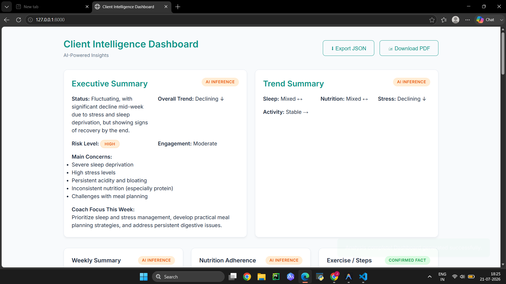

# Client Intelligence Dashboard

A modern AI-powered Dashboard for health coaches to analyze their client conversations.
This application extracts strictly structured information and provides evidence-grounded insights, originally built for the FUME GenAI Product Intern assignment.

## Features
- **Upload Functionality**: Supports PDF or TXT files of client conversations.
- **Explainable AI**: Every AI Inference provides a "▼ Why?" dropdown, explicitly listing the reasoning and the strongest evidence snippets used.
- **Strict Categorization**: Categorizes each insight strictly as:
  - ✅ Confirmed Fact
  - 🟣 Client Reported
  - 🟠 AI Inference
  - ⚪ Missing Information
- **Hallucination Prevention**: Rejects unsupported claims, displaying "Missing Information" when the provided text lacks sufficient evidence.
- **AI Quality Report**: Dynamically computes Evidence Coverage, Hallucination Risk, and counts for Facts, Inferences, Client Reported insights, and Unsupported Claims.
- **Human Review Workflow**: Coaches can Approve (✔), Edit (✏), or Reject (✖) individual AI insights.
- **Risk Badges**: Clear, color-coded severity badges (🔴 Critical, 🟠 High, 🟡 Medium, 🟢 Low) for potential client risks.
- **Export Options**: 
  - Download a cleanly formatted PDF report.
  - Export a robust JSON structure containing all analytical data.
- **Premium UI**: Clean, responsive, vanilla CSS UI with dynamic progress bars for confidence scores.

## Screenshots
.png)

.png)
.png)

## Sample Outputs & Schemas
- **Sample PDF Report**: [View PDF](outputs/Client%20Intelligence%20Dashboard22.pdf)
- **Sample JSON Output**: [View JSON](outputs/client_report_1784636680065.json)

## AI Prompt & Workflow
The logic detailing the system architecture, JSON schema constraints, and hallucination prevention rules can be found here:
- **[View Prompt & Workflow Details](prompt_workflow.md)**

Live demo is not deployed. This repository contains the complete working prototype, setup instructions, screenshots, prompt workflow, JSON schema, and demo video.

## Setup

1. Install dependencies:
```bash
python -m venv venv
# Windows
.\venv\Scripts\activate
# Mac/Linux
source venv/bin/activate

pip install -r requirements.txt
```

2. Set your API Key:
Create a `.env` file in the root directory and add your Gemini API Key:
```env
GEMINI_API_KEY=your_api_key_here
```

3. Run the Server:
```bash
uvicorn app:app --reload
```

4. Open your browser and navigate to:
[http://127.0.0.1:8000](http://127.0.0.1:8000)

## Project Structure
- `app.py`: FastAPI server
- `analyzer.py`: AI communication logic using the Gemini API and Pydantic schemas
- `prompt.py`: Structured prompt definitions
- `file_parser.py`: File parsing (PDF/TXT)
- `utils.py`: Utility functions
- `assets/`: Frontend HTML, CSS, and JS (Vanilla)
